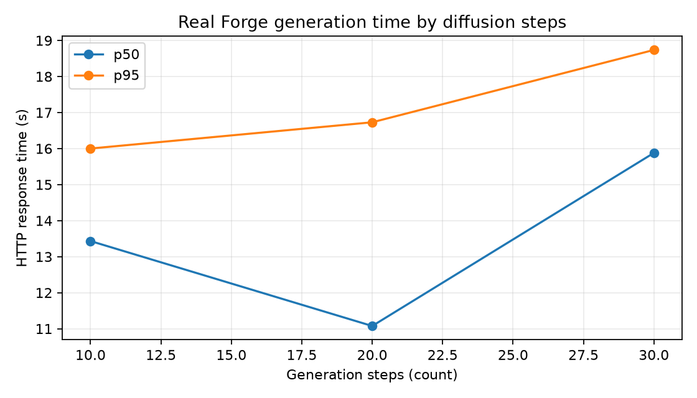

# Queue response benchmark

## Scope

This report measures the user-visible response change introduced by the backend
job queue. It compares the synchronous AI-engine request path with the queued
backend path using the same mock Forge configured with a fixed 10-second delay.
The run used three independent batches of five simultaneous jobs per path.

The SQLite database was created through the Alembic migration chain. The queued
path used normal registration, login, CSRF protection, `POST /api/generate`, and
polling through `GET /api/jobs/<id>` until every job reached `done`.

## Results

| Measurement | Samples | p50 | p95 |
|---|---:|---:|---:|
| Synchronous `POST /forge/txt2img` response | 15 | 10.036 s | 10.090 s |
| Queued `POST /api/generate` HTTP 202 | 15 | 0.0169 s | 0.0219 s |
| `GET /api/jobs/<id>` status poll | 1,667 | 0.00543 s | 0.00985 s |
| Queued time until job completion | 15 | 30.237 s | 50.323 s |

The median queued submission response was about **595× faster** than waiting for
the synchronous image response. This result shows that the queue removes the
long wait from the HTTP submission request. It does not make image generation
itself faster: one worker still processes the five jobs sequentially, so the
fifth completion in a batch occurs at about 50 seconds.

Raw trials are in `queue_comparison_raw.csv`; exact summary values are in
`queue_comparison_summary.csv`; environment and workload details are in
`queue_comparison_metadata.json`.

## Filter timing

On the same machine, a 15×15 direct 2D box convolution took 13.283 ms median and
the equivalent separable implementation took 0.816 ms median, a **16.28× measured
speedup**. The maximum output difference was 0.0000763, confirming numerical
equivalence within floating-point precision.

## Real Forge generation time by steps

The real-GPU run used the `cetusMix Whalefall2 [876b4c7ba5]` checkpoint,
`DPM++ 2M` sampler, Karras scheduler, fixed seed `12345`, and 512×512 output.
One warm-up generation was excluded. The nine recorded requests used a balanced
order so 10, 20, and 30 steps each appeared once in the early, middle, and late
position of a trial. A two-second cooldown between requests was not included in
the measured latency.

| Steps | Samples | p50 | p95 | Observed range |
|---:|---:|---:|---:|---:|
| 10 | 3 | 13.433 s | 16.001 s | 6.424–16.286 s |
| 20 | 3 | 11.076 s | 16.730 s | 7.178–17.358 s |
| 30 | 3 | 15.880 s | 18.737 s | 10.757–19.055 s |

The 30-step setting was slowest overall and p95 increased with the step count.
The 10-step and 20-step distributions overlap, and their p50 values are not
monotonic. These requests crossed a public Gradio tunnel to a remote GPU,
so network and GPU load are material sources of variation; the result should not
be presented as a precise linear scaling law. The final recorded trials required
no retries. Raw values, summary values, and run settings are stored beside this
report in the corresponding `generation_by_steps_*` files.
